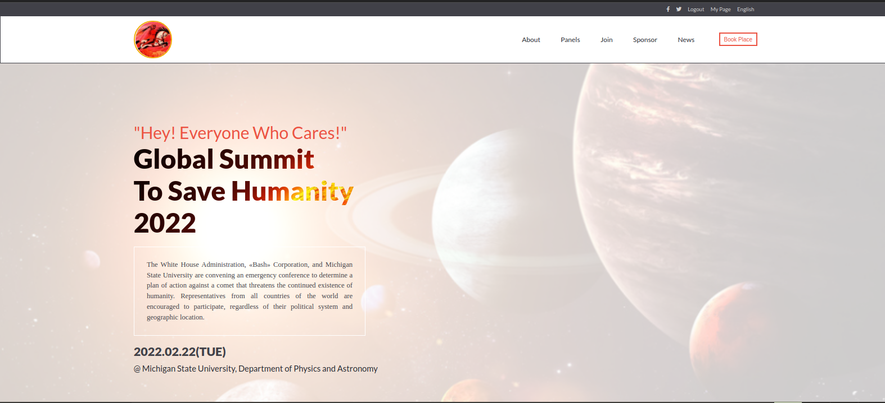

# Title

Conference Page

> This is the first HTML/CSS & JavaScript capstone project in Microverse curriculum. The idea of a fictitious conference is borrowed from the film Don't Look Up - a 2021 American satirical science fiction film written, produced and directed by Adam McKay.

## Built With

- HTML
- CSS
- JavaScript

## Live Demo

[Live Demo Link](https://gegardus.github.io/Conference-Page/)

## Video Presentation

[Presentation Link](https://www.loom.com/share/0cefca4776db455ab2993e0bb40682c5)

## Getting Started

To get a local copy, clone from the link below.

https://github.com/Gegardus/Conference-Page

## Author

Vahan Khachvankian

- GitHub: https://github.com/Gegardus

## Acknowledgment

- The webpage composition is based on an original design by: [Cindy Shin](https://www.behance.net/adagio07)

## 📝 License

This project is [MIT](./MIT.md) licensed.
